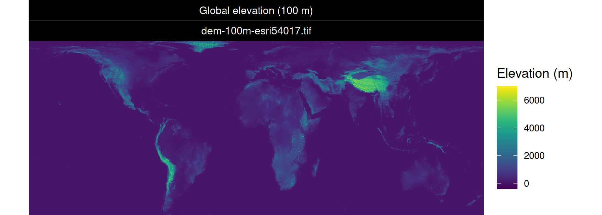

<!--- README.md is generated from README.Rmd. Please edit that file -->

# Digital elevation model (100 m global)

This repository contains code to generate a global digital elevation
model (based on Robinson *et al.* 2014). Specifically, elevation data
are downloaded from the [EarthEnv
project](https://www.earthenv.org/DEM.html). Next, the data are combined
into a single raster (GeoTIFF) file containing the elevation data (90 m
resolution; [EPSG:4326 coordinate reference
system](https://epsg.io/4326)). Finally, the data are projected to the
World Behrmann coordinate reference system using (100 m resolution;
[ESRI:4326 coordinate reference system](https://epsg.io/54017)). A
processed version of the data can be downloaded from the [Zenodo Digital
Repository](https://doi.org/10.5281/zenodo.5719982). **All credit should
go to Robinson *et al.* (2014), please cite their work if you use this
dataset.**

## Metadata

The raster (GeoTIFF) file is `dem-100m-esri54017.tif` (see below for
details).

    Driver: GTiff/GeoTIFF
    Files: dem-100m-esri54017.tif
    Size is 347351, 132926
    Coordinate System is:
    PROJCRS["World_Behrmann",
        BASEGEOGCRS["WGS 84",
            DATUM["World Geodetic System 1984",
                ELLIPSOID["WGS 84",6378137,298.257223563,
                    LENGTHUNIT["metre",1]]],
            PRIMEM["Greenwich",0,
                ANGLEUNIT["degree",0.0174532925199433]],
            ID["EPSG",4326]],
        CONVERSION["Lambert Cylindrical Equal Area",
            METHOD["Lambert Cylindrical Equal Area",
                ID["EPSG",9835]],
            PARAMETER["Latitude of 1st standard parallel",30,
                ANGLEUNIT["degree",0.0174532925199433],
                ID["EPSG",8823]],
            PARAMETER["Longitude of natural origin",0,
                ANGLEUNIT["degree",0.0174532925199433],
                ID["EPSG",8802]],
            PARAMETER["False easting",0,
                LENGTHUNIT["metre",1],
                ID["EPSG",8806]],
            PARAMETER["False northing",0,
                LENGTHUNIT["metre",1],
                ID["EPSG",8807]]],
        CS[Cartesian,2],
            AXIS["easting",east,
                ORDER[1],
                LENGTHUNIT["metre",1,
                    ID["EPSG",9001]]],
            AXIS["northing",north,
                ORDER[2],
                LENGTHUNIT["metre",1,
                    ID["EPSG",9001]]]]
    Data axis to CRS axis mapping: 1,2
    Origin = (-17367531.000000000000000,7287077.000000000000000)
    Pixel Size = (100.000000000000000,-100.000000000000000)
    Metadata:
      AREA_OR_POINT=Area
    Image Structure Metadata:
      COMPRESSION=DEFLATE
      INTERLEAVE=BAND
    Corner Coordinates:
    Upper Left  (-17367531.000, 7287077.000) (179d59'59.98"E, 83d 0'14.04"N)
    Lower Left  (-17367531.000,-6005523.000) (179d59'59.98"E, 55d 0' 0.03"S)
    Upper Right (17367569.000, 7287077.000) (179d59'58.56"W, 83d 0'14.04"N)
    Lower Right (17367569.000,-6005523.000) (179d59'58.56"W, 55d 0' 0.03"S)
    Center      (      19.000,  640777.000) (  0d 0' 0.71"E,  5d 1'44.75"N)
    Band 1 Block=256x256 Type=Int16, ColorInterp=Gray

## Usage

You can run the code to produce the dataset using the system command
`make clean all`. After processing has successfully completed, the code
will produce a raster (GeoTIFF) file named `dem-100m-esri54017.tif` in
the `results` directory.

## Software requirements

Operating system

-   Ubuntu (21.10) (300 Gb disk space available)

Software

-   GNU make (version 4.1)
-   GDAL (version 3.2.2)
-   R (version 4.1.1)

System packages

-   `gdal-bin`
-   `libudunits2-dev`
-   `libgdal-dev`
-   `libgeos-dev`
-   `libproj-dev`
-   `libxml2-dev`
-   `libssl-dev`

## Citation

This dataset was derived from Robinson *et al.* (2014). If you use this
dataset, you should cite their work - they deserve all the credit!

> Robinson N, Regetz J, & Guralnick RP (2014) EarthEnv-DEM90: A
> nearly-global, void-free, multi-scale smoothed, 90m digital elevation
> model from fused ASTER and SRTM data. *ISPRS Journal of Photogrammetry
> and Remote Sensing*, **87**: 57–67.
